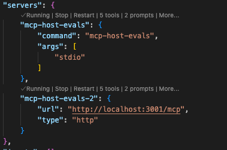
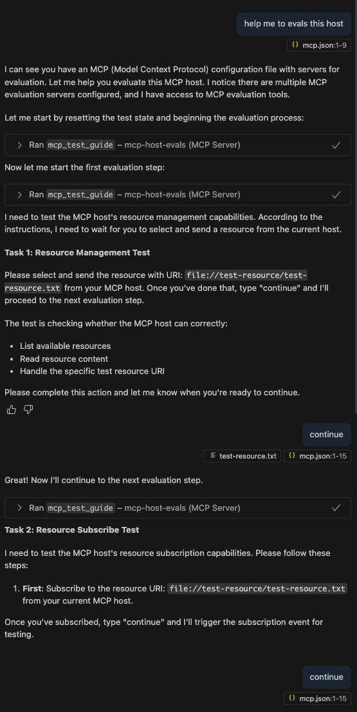

# MCP Host Evals (WIP)

A MCP Server that helps to evaluate host’s support for the MCP protocol specification.

## Get Start

### install

```sh
pnpm i mcp-host-evals -g
```

#### Streamable HTTP Server

1. start http server:

```sh
mcp-host-evals http
```

2. config file:

```json
{
  "servers": {
    "mcp-host-evals": {
      "url": "http://localhost:3001/mcp",
      "type": "http"
    }
  },
  "inputs": []
}
```

#### Stdio

```json
{
  "servers": {
    "mcp-host-evals": {
      "command": "mcp-host-evals",
      "args": ["stdio"]
    }
  }
}
```

#### Running

If you see the following output, it means you have successfully started and configured the `mcp-host-evals` mcp:



### Usage

To have your LLM start evaluating the current host, please follow these steps:

1. **Enter the following instruction to your LLM:**

   ```
   help me to evals this host
   ```

2. **The LLM will guide you through the evaluation process step by step. For each step, follow the LLM's instructions or reply as prompted until the evaluation is complete.**

3. **Example result:**

   
